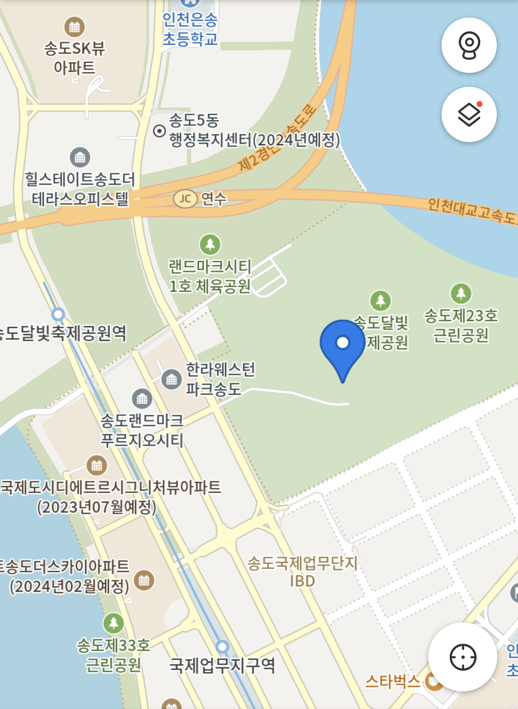
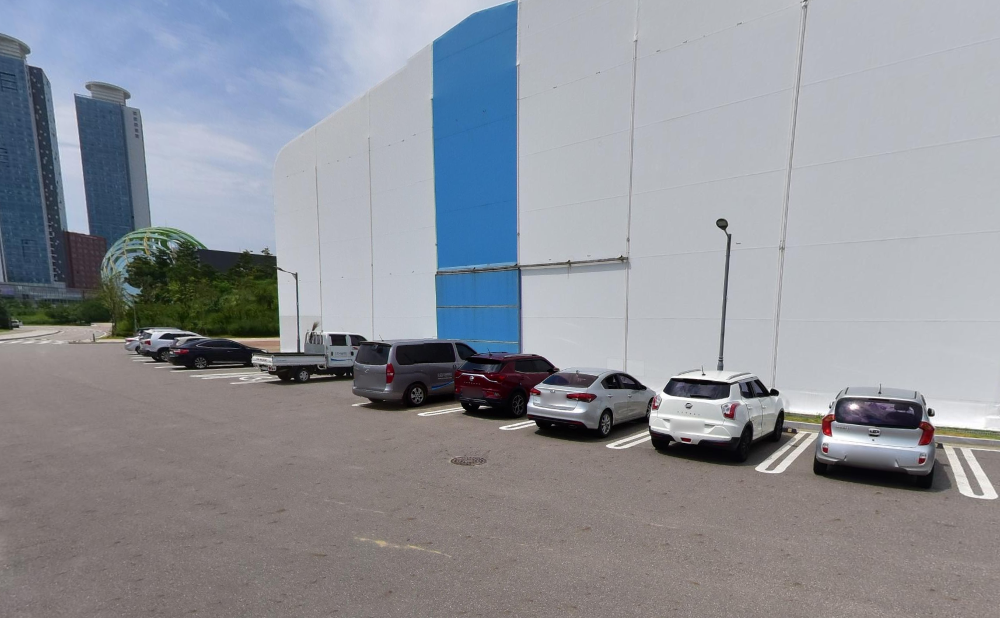
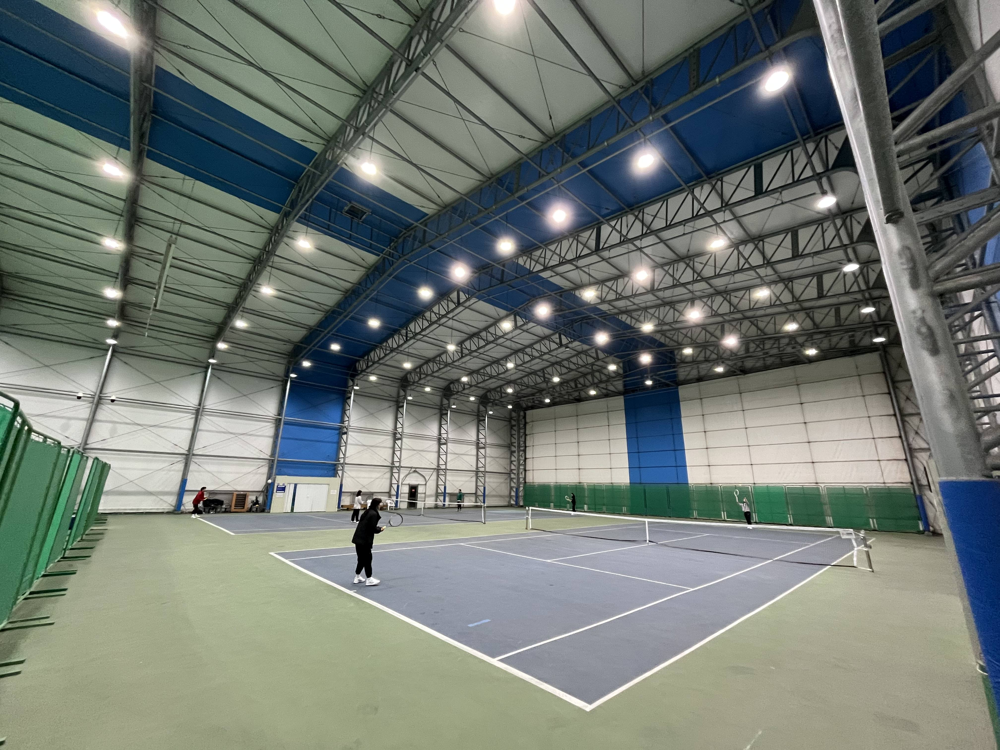

---

# 1. 위치

> - 인천광역시 연수구 센트럴로 350 달빛축제공원

# 2. 주차

> - 송도달빛축제공원 주차장과 인천 펜타포트 락 페스티벌 공연장 앞 주차장이 있다
> - 둘다 자리는 여유있으나, 행사가 있거나 하면 주차가 불가능하다
> - 인천 펜타포트 락 페스티벌 공연장 앞 주차장이 테니스장과 가깝다

# 3. 코트

> - 실내 2코트로 구성 되어있다
> - 농구, 배드민턴장과 같이 있지만 파티션으로 분리되어있어 크게 영향은 없다
> - 바닥 보수를 했을때, 미끄러워서 게임을 제대로 할 수 없다던가 하는 경우가 있다
> - 추운 겨울에는 라디에이터를 틀어줘서 실외보다는 훨씬 더 나은 환경에서 게임을 할 수 있다

# 4. 예약
> - 40,000원 ~ 60,000원 (2시간 단위 예약) (주중, 주말, 시간대 별로 가격 상이)
> - [인천시설공단 예약 바로가기](https://reserve.insiseol.or.kr/fmcs/rental/rentalSchedule.do?comcd=I_FMC3&partcd=03&placecd=11&schy=2023&schm=1)